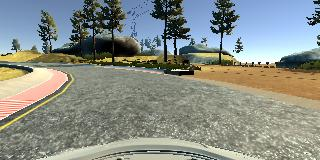

# **Behavioral Cloning** 


**Behavioral Cloning Project**

The goals / steps of this project are the following:
* Use the simulator to collect data of good driving behavior
* Build a convolution neural network in Keras that predicts steering angles from images
* Train and validate the model with a training and validation set
* Test that the model successfully drives around track one without leaving the road
* Summarize the results with a written report


## Rubric Points
### Here I will consider the [rubric points](https://review.udacity.com/#!/rubrics/432/view) individually and describe how I addressed each point in my implementation.  

---
### Files Submitted & Code Quality

#### 1. Submission includes all required files and can be used to run the simulator in autonomous mode

My project includes the following files:
* model.py containing the script to create and train the model
* drive.py for driving the car in autonomous mode
* model.h5 containing a trained convolution neural network 
* writeup_report.md summarizing the results

#### 2. Submission includes functional code
Using the Udacity provided simulator and my drive.py file, the car can be driven autonomously around the track by executing 
```sh
pip install absl-py
python drive.py model.h5
```

#### 3. Submission code is usable and readable

The model.py file contains the code for training and saving the convolution neural network. The file shows the pipeline I used for training and validating the model, and it contains comments to explain how the code works.

### Model Architecture and Training Strategy

#### 1. An appropriate model architecture has been employed

I implemented two models: a LeNet model and a model based on the Nvidia paper
 (https://devblogs.nvidia.com/deep-learning-self-driving-cars/).

Both models use covolution layers with appropriate filter sizes. Both models
include RELU layers to introduce nonlinearity.

The data is normalized using a Keras lambda layer.

See the model summary as follows.

**LeNet model**:
```
Layer (type)                 Output Shape              Param #   
=================================================================
lambda_1 (Lambda)            (None, 160, 320, 3)       0         
_________________________________________________________________
cropping2d_1 (Cropping2D)    (None, 90, 320, 3)        0         
_________________________________________________________________
conv2d_1 (Conv2D)            (None, 86, 316, 6)        456       
_________________________________________________________________
max_pooling2d_1 (MaxPooling2 (None, 43, 158, 6)        0         
_________________________________________________________________
dropout_1 (Dropout)          (None, 43, 158, 6)        0         
_________________________________________________________________
conv2d_2 (Conv2D)            (None, 39, 154, 16)       2416      
_________________________________________________________________
max_pooling2d_2 (MaxPooling2 (None, 19, 77, 16)        0         
_________________________________________________________________
dropout_2 (Dropout)          (None, 19, 77, 16)        0         
_________________________________________________________________
flatten_1 (Flatten)          (None, 23408)             0         
_________________________________________________________________
dense_1 (Dense)              (None, 120)               2809080   
_________________________________________________________________
dense_2 (Dense)              (None, 84)                10164     
_________________________________________________________________
dense_3 (Dense)              (None, 1)                 85        
=================================================================
```

**Nvidia model**:
```
Layer (type)                 Output Shape              Param #   
=================================================================
lambda_1 (Lambda)            (None, 160, 320, 3)       0         
_________________________________________________________________
cropping2d_1 (Cropping2D)    (None, 90, 320, 3)        0         
_________________________________________________________________
batch_normalization_1 (Batch (None, 90, 320, 3)        12        
_________________________________________________________________
conv2d_1 (Conv2D)            (None, 43, 158, 24)       1824      
_________________________________________________________________
dropout_1 (Dropout)          (None, 43, 158, 24)       0         
_________________________________________________________________
conv2d_2 (Conv2D)            (None, 20, 77, 36)        21636     
_________________________________________________________________
dropout_2 (Dropout)          (None, 20, 77, 36)        0         
_________________________________________________________________
conv2d_3 (Conv2D)            (None, 8, 37, 48)         43248     
_________________________________________________________________
dropout_3 (Dropout)          (None, 8, 37, 48)         0         
_________________________________________________________________
conv2d_4 (Conv2D)            (None, 3, 18, 64)         27712     
_________________________________________________________________
dropout_4 (Dropout)          (None, 3, 18, 64)         0         
_________________________________________________________________
conv2d_5 (Conv2D)            (None, 1, 16, 64)         36928     
_________________________________________________________________
dropout_5 (Dropout)          (None, 1, 16, 64)         0         
_________________________________________________________________
flatten_1 (Flatten)          (None, 1024)              0         
_________________________________________________________________
dense_1 (Dense)              (None, 1164)              1193100   
_________________________________________________________________
dense_2 (Dense)              (None, 100)               116500    
_________________________________________________________________
dense_3 (Dense)              (None, 50)                5050      
_________________________________________________________________
dense_4 (Dense)              (None, 10)                510       
_________________________________________________________________
dense_5 (Dense)              (None, 1)                 11        
=================================================================
```
 

#### 2. Attempts to reduce overfitting in the model

Both models contains dropout layers to reduce overfitting. 

The driving images are split into training set and validation set.
Test was done by running the model through the simulator.

#### 3. Model parameter tuning

An Adam optimizer was used to train the model, so the learn rate was not tuned manually.

#### 4. Appropriate training data

I generated the training data by driving the car on on the road, closing to the
center lane as much as possible. 

### Architecture and Training

#### 1. Solution Design Approach

I started with the classical LeNet model and tested it with the simulator. The
car went off the road at the red curb before the bridge. I then improved the
pipeline incrementally:

* Flip images.
* Use the left and right cameras.
* Crop images (top 50 pixels and bottom 20 pixels)
* Add dropout and batch normalization.
* Implemented the Nvidia model.

Testing on the simulator improved accordingly. The car went through the bridge,
the curb after the bridge, until it drove into the lake.
I then generated training data by driving the car in the second track.

With training data from both tracks, the car can drive safely on the road of the first track.


#### 3. Creation of the Training Set & Training Process

I recorded driving in the simulator using two strategies:
* Keep the car in the center. This is the default strategy most of the time.
* Drift the car to the edge of the lane, then turn back to the center.
 I did this strategy a few times in places of small curvatures.

Here is an example image of center lane driving:


And here is an example image of edge driving:


